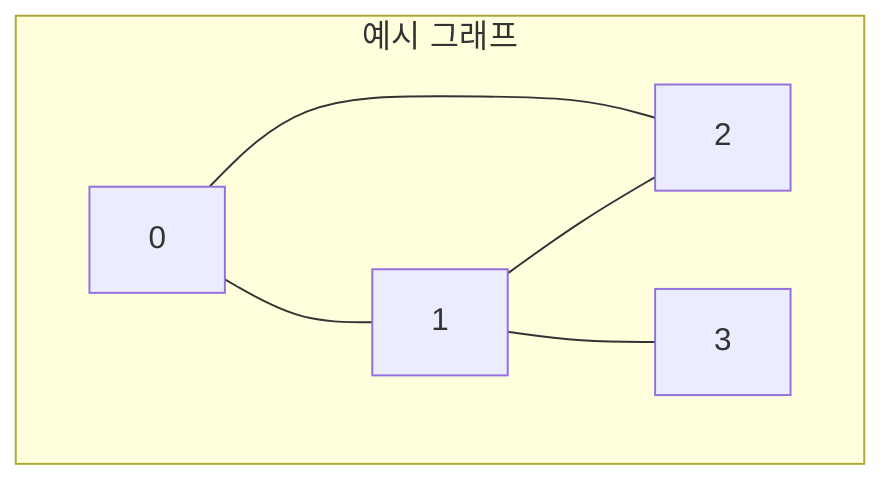

## 그래프(Graph) 개요

그래프(Graph)는 정점(Vertex)과 이들을 연결하는 간선(Edge)의 집합으로 구성된 비선형 자료구조이다. 네트워크, 도로망, 소셜 관계망 등 현실 세계의 복잡한 연결 관계를 모델링하는 데 널리 사용된다. 트리와 달리 부모-자식 관계가 없으며, 사이클(Cycle)을 형성할 수 있는 유연한 구조를 가진다.

## 그래프의 핵심 용어

- **정점 (Vertex)**: 데이터를 나타내는 개체. 노드(Node)라고도 불린다.
- **간선 (Edge)**: 두 정점을 연결하는 선.
- **차수 (Degree)**: 한 정점에 연결된 간선의 개수.
- **인접 정점 (Adjacent Vertex)**: 하나의 간선으로 직접 연결된 두 정점.
- **경로 (Path)**: 간선을 따라 이동할 수 있는 정점들의 순서.
- **사이클 (Cycle)**: 경로의 시작 정점과 끝 정점이 동일한 경우.
- **연결 그래프 (Connected Graph)**: 모든 정점 쌍 사이에 경로가 존재하는 그래프.
- **완전 그래프 (Complete Graph)**: 모든 정점 쌍 사이에 직접적인 간선이 존재하는 그래프.

## 그래프의 종류

1.  **무방향 그래프 (Undirected Graph)**: 간선에 방향이 없어 양방향 이동이 가능한 그래프.
2.  **방향 그래프 (Directed Graph)**: 간선이 특정 방향을 가지는 그래프.
3.  **가중치 그래프 (Weighted Graph)**: 간선에 비용, 거리 등의 가중치가 부여된 그래프.

## 그래프의 표현 방법

그래프를 프로그래밍으로 구현하기 위한 대표적인 두 가지 방법은 인접 행렬과 인접 리스트이다.

### 1. 인접 행렬 (Adjacency Matrix)

N개의 정점을 가진 그래프를 N x N 크기의 2차원 배열로 표현하는 방식이다. `matrix[i][j]`의 값은 정점 `i`와 `j`의 연결 상태를 나타낸다 (연결 시 1, 비연결 시 0).



**인접 행렬 시각화:**
|   | **0** | **1** | **2** | **3** |
|---|:---:|:---:|:---:|:---:|
|**0**| 0 | 1 | 1 | 0 |
|**1**| 1 | 0 | 1 | 1 |
|**2**| 1 | 1 | 0 | 0 |
|**3**| 0 | 1 | 0 | 0 |

- **장점**: 두 정점 간의 연결 여부를 **O(1)** 시간에 즉시 확인할 수 있다.
- **단점**: 간선 수와 무관하게 항상 **O(N²)**의 공간이 필요하여, 간선이 적은 그래프에서는 메모리 낭비가 심하다.

#### C언어 구현 예시

```c
#include <stdio.h>
#include <stdlib.h>

#define MAX_VERTICES 50

typedef struct {
    int n; // 정점의 개수
    int adj_mat[MAX_VERTICES][MAX_VERTICES];
} Graph_Matrix;

// 그래프 초기화
void init_matrix(Graph_Matrix* g) {
    g->n = 0;
    for (int i = 0; i < MAX_VERTICES; i++) {
        for (int j = 0; j < MAX_VERTICES; j++) {
            g->adj_mat[i][j] = 0;
        }
    }
}

// 간선 삽입
void insert_edge_matrix(Graph_Matrix* g, int start, int end) {
    if (start >= g->n || end >= g->n) {
        fprintf(stderr, "그래프: 정점 번호 오류");
        return;
    }
    g->adj_mat[start][end] = 1;
    g->adj_mat[end][start] = 1; // 무방향 그래프의 경우
}
```

### 2. 인접 리스트 (Adjacency List)

각 정점에 연결된 인접 정점들의 목록을 연결 리스트로 관리하는 방식이다.


**인접 리스트 시각화:**
- 0: [1, 2]
- 1: [0, 2, 3]
- 2: [0, 1]
- 3: [1]

- **장점**: 그래프에 존재하는 간선의 수만큼만 메모리를 사용하여 공간 효율성이 뛰어나다. (공간 복잡도: O(V+E))
- **단점**: 두 정점의 연결 여부를 확인하려면 해당 정점의 리스트를 순회해야 하므로, 인접 행렬보다 시간이 더 걸릴 수 있다. (최악 O(V))

#### C언어 구현 예시

```c
#include <stdio.h>
#include <stdlib.h>

#define MAX_VERTICES 50

typedef struct GraphNode {
    int vertex;
    struct GraphNode* link;
} GraphNode;

typedef struct {
    int n; // 정점의 개수
    GraphNode* adj_list[MAX_VERTICES];
} Graph_List;

// 그래프 초기화
void init_list(Graph_List* g) {
    g->n = 0;
    for (int i = 0; i < MAX_VERTICES; i++) {
        g->adj_list[i] = NULL;
    }
}

// 간선 삽입
void insert_edge_list(Graph_List* g, int u, int v) {
    if (u >= g->n || v >= g->n) {
        fprintf(stderr, "그래프: 정점 번호 오류");
        return;
    }
    GraphNode* node = (GraphNode*)malloc(sizeof(GraphNode));
    node->vertex = v;
    node->link = g->adj_list[u];
    g->adj_list[u] = node;
}
```
두 표현 방식은 각각의 장단점이 뚜렷하므로, 풀고자 하는 문제의 특성과 그래프의 밀집도(간선 수)에 따라 적절한 방법을 선택해야 한다.

---

**다음 글**: [그래프 탐색(DFS &amp; BFS)](/posts/그래프탐색/)
