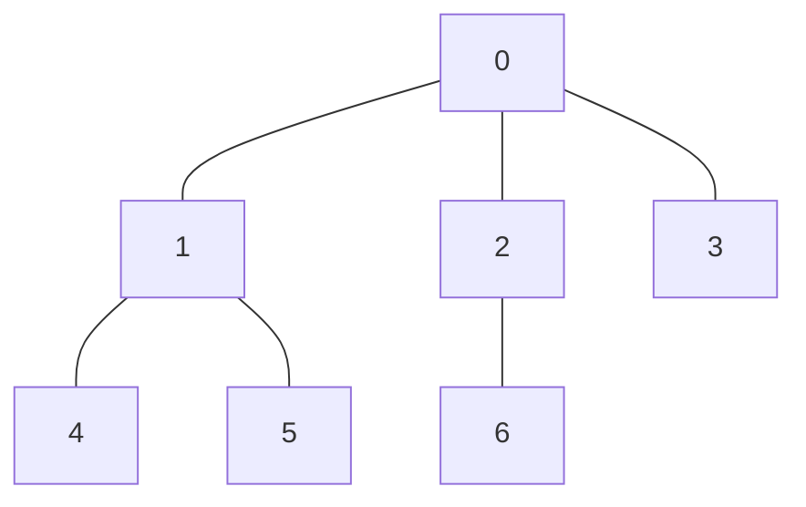

**이전 글**: [그래프](/posts/그래프/)

## 그래프 탐색(Graph Traversal) 개요

그래프 탐색은 그래프의 모든 정점을 한 번씩, 체계적으로 방문하는 알고리즘이다. 그래프의 구조를 파악하거나, 특정 경로를 찾는 등 다양한 문제 해결의 기반이 된다. 대표적인 탐색 방법으로는 깊이 우선 탐색(DFS)과 너비 우선 탐색(BFS)이 있다.

## 1. 깊이 우선 탐색 (DFS, Depth-First Search)

깊이 우선 탐색은 시작 정점에서 한 방향으로 갈 수 있을 때까지 최대한 깊이 파고든 후, 더 이상 진행할 수 없으면 이전 정점으로 돌아와 다른 경로를 탐색하는 방식이다. **스택(Stack)** 자료구조의 원리를 이용하며, 구현은 주로 **재귀 함수**를 통해 이루어진다.

### C언어 구현 (인접 리스트 기반)

```c
#include <stdio.h>
#include <stdlib.h>

#define MAX_VERTICES 50

// 그래프 표현은 이전 포스트의 인접 리스트 구조체 사용
typedef struct GraphNode {
    int vertex;
    struct GraphNode* link;
} GraphNode;

typedef struct {
    int n;
    GraphNode* adj_list[MAX_VERTICES];
} Graph_List;

int visited[MAX_VERTICES]; // 방문 기록 배열

void dfs_list(Graph_List* g, int v) {
    visited[v] = 1; // 현재 정점 방문 표시
    printf("정점 %d -> ", v);

    // 현재 정점의 인접 리스트를 순회
    for (GraphNode* w = g->adj_list[v]; w != NULL; w = w->link) {
        if (!visited[w->vertex]) {
            dfs_list(g, w->vertex); // 방문하지 않은 인접 정점에 대해 재귀 호출
        }
    }
}
```

## 2. 너비 우선 탐색 (BFS, Breadth-First Search)

너비 우선 탐색은 시작 정점에서 가장 가까운 정점들을 먼저 모두 방문하고, 그 다음 단계의 정점들을 순차적으로 방문하는 방식이다. **큐(Queue)** 자료구조를 사용하여 구현하며, 두 노드 사이의 최단 경로를 찾는 데 유용하다.

### C언어 구현 (인접 리스트 기반)

```c
// 배열 기반 큐 구조체 정의
#define MAX_QUEUE_SIZE 100

typedef struct {
    int data[MAX_QUEUE_SIZE];
    int front;
    int rear;
} Queue;

// 큐 생성 함수
Queue* create_queue() {
    Queue* q = (Queue*)malloc(sizeof(Queue));
    q->front = 0;
    q->rear = 0;
    return q;
}

// 큐가 비어있는지 확인
int is_empty(Queue* q) {
    return q->front == q->rear;
}

// 큐에 요소 삽입
void enqueue(Queue* q, int vertex) {
    if ((q->rear + 1) % MAX_QUEUE_SIZE == q->front) {
        fprintf(stderr, "큐가 가득 찼습니다.\n");
        return;
    }
    q->data[q->rear] = vertex;
    q->rear = (q->rear + 1) % MAX_QUEUE_SIZE;
}

// 큐에서 요소 제거
int dequeue(Queue* q) {
    if (is_empty(q)) {
        fprintf(stderr, "큐가 비어 있습니다.\n");
        return -1;
    }
    int vertex = q->data[q->front];
    q->front = (q->front + 1) % MAX_QUEUE_SIZE;
    return vertex;
}

// 큐 메모리 해제
void free_queue(Queue* q) {
    free(q);
}

void bfs_list(Graph_List* g, int v) {
    visited[v] = 1; // 시작 정점 방문 표시
    printf("정점 %d -> ", v);
    
    Queue* q = create_queue();
    enqueue(q, v);

    while (!is_empty(q)) {
        int current_v = dequeue(q);

        // 현재 정점의 인접 리스트 순회
        for (GraphNode* w = g->adj_list[current_v]; w != NULL; w = w->link) {
            if (!visited[w->vertex]) {
                visited[w->vertex] = 1; // 방문 표시
                printf("정점 %d -> ", w->vertex);
                enqueue(q, w->vertex);
            }
        }
    }
    free_queue(q);
}
```

## DFS vs BFS

| 구분 | 깊이 우선 탐색 (DFS) | 너비 우선 탐색 (BFS) |
|---|---|---|
| **탐색 방식** | 한 방향으로 깊게 탐색 | 현재 위치에서 가까운 곳부터 탐색 |
| **자료구조** | 스택(Stack), 재귀 | 큐(Queue) |
| **경로 탐색** | 모든 경로를 탐색해야 할 때 유리 | 최단 경로를 찾을 때 유리 |
| **메모리 사용** | 경로의 길이에 비례 | 정점의 수에 비례 |

**탐색 순서 예시:**
아래 그래프에서 정점 0부터 탐색을 시작한다고 가정하자.



- **DFS 예상 경로**: `0 → 1 → 4 → 5 → 2 → 6 → 3` (단, 인접 정점 방문 순서에 따라 결과는 달라질 수 있음)
- **BFS 경로**: `0 → 1 → 2 → 3 → 4 → 5 → 6`
