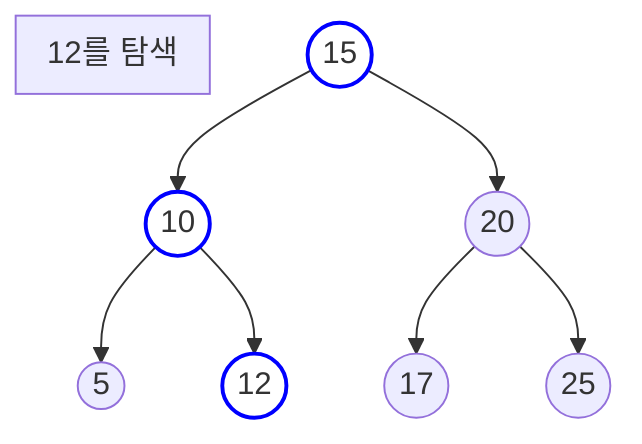
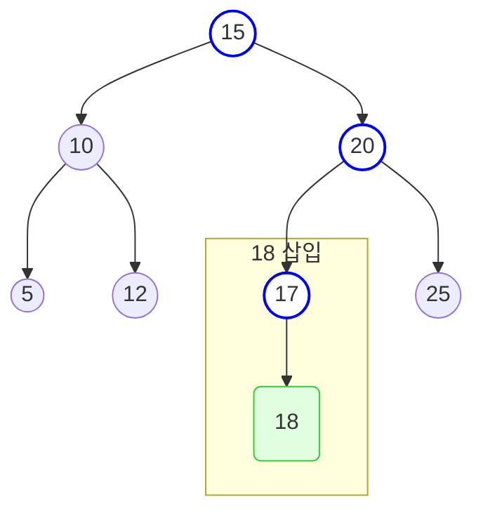
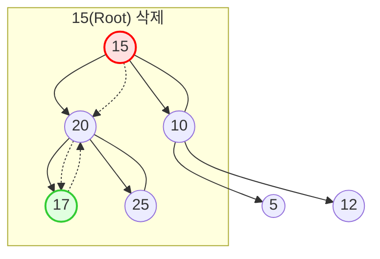

**관련 글**: [트리](/posts/트리/), [트리의 순회](/posts/트리순회/)

## 이진 탐색 트리(Binary Search Tree) 개요

이진 탐색 트리(BST)는 효율적인 탐색을 위해 이진 트리에 다음과 같은 특정 규칙을 추가한 자료구조이다.

- 각 노드의 키(key) 값은 유일하다.
- 특정 노드의 **왼쪽 서브트리**에 있는 모든 노드의 키 값은 해당 노드의 키 값보다 **작다**.
- 특정 노드의 **오른쪽 서브트리**에 있는 모든 노드의 키 값은 해당 노드의 키 값보다 **크다**.
- 왼쪽과 오른쪽 서브트리 역시 각각 이진 탐색 트리이다.

이러한 구조적 특징 덕분에 데이터 탐색, 삽입, 삭제 연산의 평균 시간 복잡도가 **O(log n)**으로 매우 효율적이다.

## 이진 탐색 트리의 C언어 구현

기본적인 노드 구조체는 일반 이진 트리와 동일하지만, `key`라는 명칭을 사용하여 값의 의미를 명확히 할 수 있다.

```c
#include <stdio.h>
#include <stdlib.h>

typedef struct TreeNode {
    int key;
    struct TreeNode *left;
    struct TreeNode *right;
} TreeNode;
```

### 1. 탐색 (Search) 연산


탐색은 BST의 핵심 연산이다. 루트에서 시작하여 찾으려는 키 값과 현재 노드의 키 값을 비교하며 경로를 결정한다.





```c

// 재귀적 탐색 함수

TreeNode* search(TreeNode* root, int key) {
    if (root == NULL || root->key == key) {
        return root;
    }

    if (key < root->key) {
        return search(root->left, key);
    } else {
        return search(root->right, key);
    }
}
```

### 2. 삽입 (Insertion) 연산


새로운 노드를 삽입할 때도 탐색과 유사한 과정을 거친다. 키 값을 비교하며 내려가다가, 비어있는 위치(NULL)에 도달하면 그곳에 새 노드를 추가한다.





```c

TreeNode* create_node(int key) {
    TreeNode* new_node = (TreeNode*)malloc(sizeof(TreeNode));
    new_node->key = key;
    new_node->left = NULL;
    new_node->right = NULL;
    return new_node;
}

TreeNode* insert_node(TreeNode* root, int key) {
    if (root == NULL) {
        return create_node(key);
    }

    if (key < root->key) {
        root->left = insert_node(root->left, key);
    } else if (key > root->key) {
        root->right = insert_node(root->right, key);
    }

    // key가 이미 트리에 있는 경우, 변경 없이 root 반환
    return root;
}
```

### 3. 삭제 (Deletion) 연산

삭제는 BST 연산 중 가장 복잡하며, 삭제할 노드의 자식 수에 따라 세 가지 경우로 나뉜다.



1.  **자식이 없는 리프 노드**: 해당 노드의 메모리를 해제하고 부모 노드의 링크를 NULL로 설정한다.
2.  **자식이 하나인 노드**: 삭제할 노드를 그 하나의 자식 노드로 대체한다.
3.  **자식이 둘인 노드**: 삭제할 노드를 그 **오른쪽 서브트리에서 가장 작은 노드(In-order Successor)** 또는 **왼쪽 서브트리에서 가장 큰 노드(In-order Predecessor)**로 대체한 후, 대체된 노드를 원래 위치에서 삭제한다.

```c
// 오른쪽 서브트리에서 가장 작은 노드를 찾는 함수
TreeNode* find_min_value_node(TreeNode* node) {
    TreeNode* current = node;
    while (current && current->left != NULL) {
        current = current->left;
    }
    return current;
}

TreeNode* delete_node(TreeNode* root, int key) {
    if (root == NULL) return root;

    // 삭제할 노드를 찾는다
    if (key < root->key) {
        root->left = delete_node(root->left, key);
    } else if (key > root->key) {
        root->right = delete_node(root->right, key);
    } else { // 삭제할 노드를 찾은 경우
        // Case 1: 자식이 없거나 하나인 경우
        if (root->left == NULL) {
            TreeNode *temp = root->right;
            free(root);
            return temp;
        } else if (root->right == NULL) {
            TreeNode *temp = root->left;
            free(root);
            return temp;
        }

        // Case 2: 자식이 둘인 경우
        TreeNode* temp = find_min_value_node(root->right); // 후계자 찾기
        root->key = temp->key; // 후계자의 키 값을 복사
        root->right = delete_node(root->right, temp->key); // 후계자 노드 삭제
    }
    return root;
}
```

## 이진 탐색 트리의 한계

이진 탐색 트리는 데이터가 무작위로 삽입될 때 평균 O(log n)의 성능을 보이지만, 데이터가 정렬된 순서로 삽입되면 한쪽으로만 노드가 추가되는 **편향 트리(Skewed Tree)**가 될 수 있다. 이 경우, 탐색, 삽입, 삭제 연산의 시간 복잡도는 최악인 **O(n)**까지 저하된다. 이러한 문제를 해결하기 위해 `AVL 트리`나 `Red-Black 트리`와 같은 **자가 균형(Self-Balancing)** 기능을 갖춘 이진 탐색 트리가 고안되었다.
