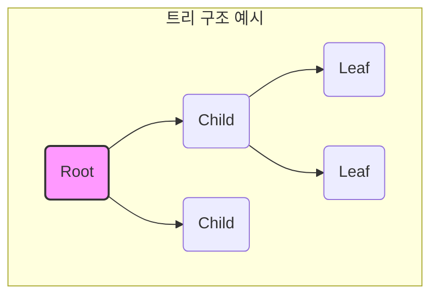
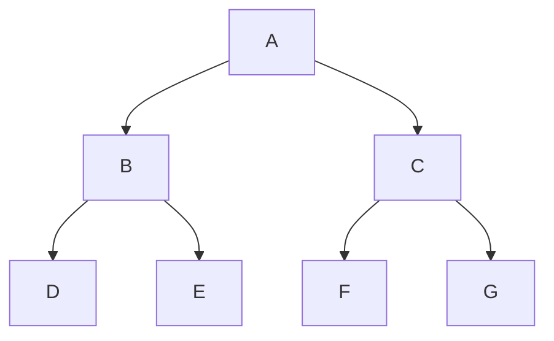
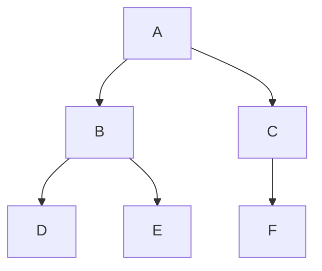

## 트리(Tree) 개요

트리(Tree)는 데이터 요소(노드)들을 계층적으로 연결한 자료구조로, 나무를 거꾸로 뒤집은 형태를 가진다. 루트(Root)라 불리는 최상위 노드에서 시작하여 여러 하위 노드로 가지를 치며 뻗어 나가지만, 노드 간의 관계에서 사이클(Cycle)은 형성되지 않는 것이 특징이다.

## 트리의 핵심 용어

트리 구조를 이해하기 위한 핵심 용어는 다음과 같다.

- **노드 (Node)**: 트리를 구성하는 기본 요소. 데이터 값을 가지며 다른 노드와의 연결 정보를 포함한다.
- **루트 (Root)**: 부모가 없는 최상위 노드. (예: A)
- **간선 (Edge)**: 노드와 노드를 연결하는 선.
- **부모 (Parent) / 자식 (Child)**: 간선으로 연결된 두 노드 간의 관계. 위쪽이 부모, 아래쪽이 자식이다. (예: A는 B와 C의 부모)
- **형제 (Sibling)**: 동일한 부모를 가지는 노드들.
- **선조 (Ancestor)**: 루트 노드에서 특정 노드까지의 경로 상에 있는 모든 노드.
- **자손 (Descendant)**: 특정 노드로부터 뻗어 나가는 하위 모든 노드.
- **리프 (Leaf) 노드**: 자식이 없는 노드. 트리의 가장 말단에 위치한다. (예: D, E)
- **내부 (Internal) 노드**: 리프 노드가 아닌, 즉 하나 이상의 자식을 가진 노드. (예: A, B)
- **깊이 (Depth)**: 루트 노드로부터 특정 노드까지의 간선 수. 루트의 깊이는 0이다.
- **높이 (Height)**: 트리의 최대 깊이. 즉, 루트로부터 가장 멀리 떨어진 리프 노드까지의 깊이를 의미한다.
- **서브트리 (Subtree)**: 하나의 노드와 그 노드의 모든 자손들로 구성된 부분적인 트리.

## 이진 트리 (Binary Tree)

**이진 트리**는 모든 노드가 최대 두 개의 자식(왼쪽 자식, 오른쪽 자식)을 가질 수 있도록 정의된 트리이다. 이진 트리는 다양한 형태로 존재하며, 그중 대표적인 것은 다음과 같다.

### 이진 트리의 성질

이진 트리는 다음과 같은 일반적인 성질을 가진다.
- 노드의 개수가 N개인 이진 트리는 N-1개의 간선을 가진다.
- 높이가 h인 이진 트리의 최소 노드 수는 h+1개이고, 최대 노드 수는 2^(h+1) - 1개이다.
- N개의 노드를 가진 이진 트리의 최대 높이는 N, 최소 높이는 log₂(N+1)이다.

### 1. 포화 이진 트리 (Full Binary Tree)

모든 노드가 0개 또는 2개의 자식을 가지며, 모든 리프 노드가 동일한 깊이에 위치하는 트리. 레벨 `k`에서의 노드 수는 `2^(k-1)`개이며, 높이가 `h`인 트리의 총 노드 수는 `2^h - 1`개이다.

### 2. 완전 이진 트리 (Complete Binary Tree)

마지막 레벨을 제외한 모든 레벨이 완전히 채워져 있고, 마지막 레벨의 노드들은 왼쪽부터 순서대로 채워져 있는 트리. 포화 이진 트리는 완전 이진 트리의 특수한 경우이다. 배열을 사용하여 효율적으로 표현할 수 있어 힙(Heap) 자료구조의 기반이 된다.

## 이진 트리의 활용

이진 트리는 컴퓨터 과학의 다양한 영역에서 핵심적으로 활용된다. 대표적인 활용 분야는 다음과 같다.

- **이진 탐색 트리 (BST)**: 효율적인 탐색, 삽입, 삭제 연산을 위한 자료구조
- **힙 (Heap)**: 완전 이진 트리를 기반으로 한 우선순위 큐 구현
- **표현식 트리 (Expression Tree)**: 수식의 구조를 표현하고 계산하는 데 사용
- **허프만 코딩 (Huffman Coding)**: 데이터 압축 알고리즘에 활용

트리 자료구조를 제대로 이해하고 활용하기 위해서는 트리 순회 방법과 이진 탐색 트리의 동작 원리를 함께 학습하는 것이 중요하다.

---

**다음 글**: [트리의 순회](/posts/트리순회/)
