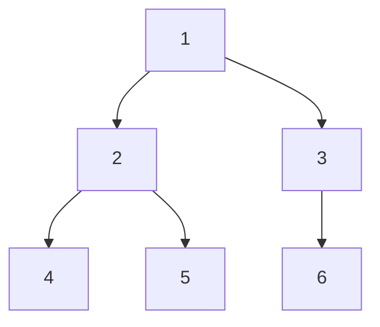

**이전 글**: [트리](/posts/트리/)

## 트리 순회(Traversal) 개요

트리 순회는 트리의 모든 노드를 중복 없이, 한 번씩 방문하는 체계적인 방법을 의미한다. 노드를 방문하는 순서에 따라 여러 종류의 순회 방법이 있으며, 각각의 방법은 특정 목적에 유용하게 사용된다.

먼저, 순회 로직을 구현하기 위한 기본적인 C언어 트리 노드 구조체는 다음과 같이 정의된다.

```c
#include <stdio.h>
#include <stdlib.h>

typedef struct TreeNode {
    int data;
    struct TreeNode *left;
    struct TreeNode *right;
} TreeNode;
```

## 재귀를 이용한 순회 (Recursive Traversal)

재귀는 트리 구조의 특성을 자연스럽게 반영할 수 있어 전위, 중위, 후위 순회를 구현하는 데 널리 사용된다.

### 1. 전위 순회 (Pre-order Traversal)

**루트 → 왼쪽 서브트리 → 오른쪽 서브트리** 순서로 노드를 방문한다. `VLR` (Visit-Left-Right)로 요약할 수 있다. 트리를 복사하거나, 트리의 구조를 포함한 표현식을 만들 때 유용하다.

```c
void preorder_traversal(TreeNode *root) {
    if (root != NULL) {
        printf("[%d] ", root->data);  // V: 루트 노드 방문
        preorder_traversal(root->left);   // L: 왼쪽 서브트리 순회
        preorder_traversal(root->right);  // R: 오른쪽 서브트리 순회
    }
}
```

### 2. 중위 순회 (In-order Traversal)

**왼쪽 서브트리 → 루트 → 오른쪽 서브트리** 순서로 노드를 방문한다. `LVR` (Left-Visit-Right)로 요약된다. 이진 탐색 트리(BST)를 중위 순회하면 노드의 키 값들이 오름차순으로 정렬되어 출력되는 특징이 있다.

```c
void inorder_traversal(TreeNode *root) {
    if (root != NULL) {
        inorder_traversal(root->left);    // L: 왼쪽 서브트리 순회
        printf("[%d] ", root->data);   // V: 루트 노드 방문
        inorder_traversal(root->right);   // R: 오른쪽 서브트리 순회
    }
}
```

### 3. 후위 순회 (Post-order Traversal)

**왼쪽 서브트리 → 오른쪽 서브트리 → 루트** 순서로 노드를 방문한다. `LRV` (Left-Right-Visit)로 요약된다. 자식 노드를 먼저 모두 방문한 후 부모 노드를 방문하는 특성 때문에, 트리를 삭제(메모리 해제)할 때 사용된다.

```c
void postorder_traversal(TreeNode *root) {
    if (root != NULL) {
        postorder_traversal(root->left);  // L: 왼쪽 서브트리 순회
        postorder_traversal(root->right); // R: 오른쪽 서브트리 순회
        printf("[%d] ", root->data);  // V: 루트 노드 방문
    }
}
```

## 레벨 순회 (Level-order Traversal)

레벨 순회는 루트 노드부터 시작하여 트리의 각 레벨을 왼쪽에서 오른쪽으로 순서대로 방문하는 방법이다. 그래프의 너비 우선 탐색(BFS)과 동일한 원리로 동작하며, 큐(Queue) 자료구조를 사용하여 구현한다.

```c
// 배열 기반 큐 구조체 정의
#define MAX_QUEUE_SIZE 100

typedef struct {
    TreeNode* data[MAX_QUEUE_SIZE];
    int front;
    int rear;
} Queue;

// 큐 생성 함수
Queue* create_queue() {
    Queue* q = (Queue*)malloc(sizeof(Queue));
    q->front = 0;
    q->rear = 0;
    return q;
}

// 큐가 비어있는지 확인
int is_empty(Queue* q) {
    return q->front == q->rear;
}

// 큐에 요소 삽입
void enqueue(Queue* q, TreeNode* node) {
    if ((q->rear + 1) % MAX_QUEUE_SIZE == q->front) {
        fprintf(stderr, "큐가 가득 찼습니다.\n");
        return;
    }
    q->data[q->rear] = node;
    q->rear = (q->rear + 1) % MAX_QUEUE_SIZE;
}

// 큐에서 요소 제거
TreeNode* dequeue(Queue* q) {
    if (is_empty(q)) {
        fprintf(stderr, "큐가 비어 있습니다.\n");
        return NULL;
    }
    TreeNode* node = q->data[q->front];
    q->front = (q->front + 1) % MAX_QUEUE_SIZE;
    return node;
}

// 큐 메모리 해제
void free_queue(Queue* q) {
    free(q);
}

void level_order_traversal(TreeNode *root) {
    if (root == NULL) return;

    // 큐 생성 및 초기화
    Queue* q = create_queue(); 
    enqueue(q, root);

    while (!is_empty(q)) {
        TreeNode* current = dequeue(q);
        printf("[%d] ", current->data);

        if (current->left != NULL) {
            enqueue(q, current->left);
        }
        if (current->right != NULL) {
            enqueue(q, current->right);
        }
    }
    
    free_queue(q);
}
```

**순회 예시:**

아래와 같은 트리가 있을 때 각 순회 방식의 결과는 다음과 같다.



- **전위 순회**: `1 → 2 → 4 → 5 → 3 → 6`
- **중위 순회**: `4 → 2 → 5 → 1 → 6 → 3`
- **후위 순회**: `4 → 5 → 2 → 6 → 3 → 1`
- **레벨 순회**: `1 → 2 → 3 → 4 → 5 → 6`

---

**관련 글**: [이진 탐색 트리(BST)](/posts/이진탐색트리/)
